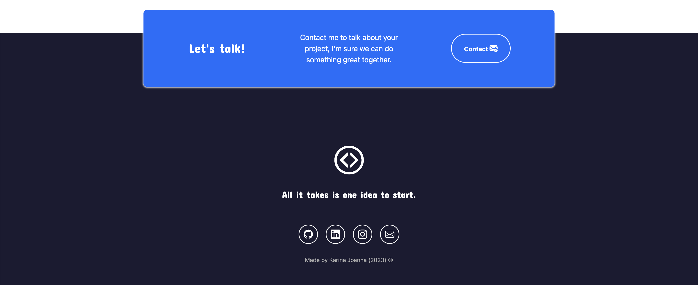

#  Portfolio 

> Author: Karina Joanna Xochipa Mendoza 🦾

Hey there! This project was created for the Tecnolochicas PRO bootcamp, in this Portfolio, designed with tecnologies like HTML, CSS, JS and Bootstrap, to show my work, here you will find a showcase of my passion for web development and design. With a focus on creating visually stunning and functional websites. **I invite you to give a look at my work and do not hesitate to contact me❗️**. 


### Presentation


### Experience


### Projects 💻


### Witness 👩🏻 👨🏽


### Contact 👤



## Tecnologías

This page was created using:

* HTML
* CSS
* JavaScript 
* Bootstrap 5

Additionally, **Google Fonts**  were included to customize the font, and **Bootstrap icons**  were incorporated to add icons such as arrows and logos of popular social media platforms.

## English

The text on the webpage is written in English and so is all the code.

##  ✨ Visualization ✨

You can view the final project by simply clicking on the following link, which will direct you to the website.

```sh
https://portfoliotcprokj.netlify.app/
```


