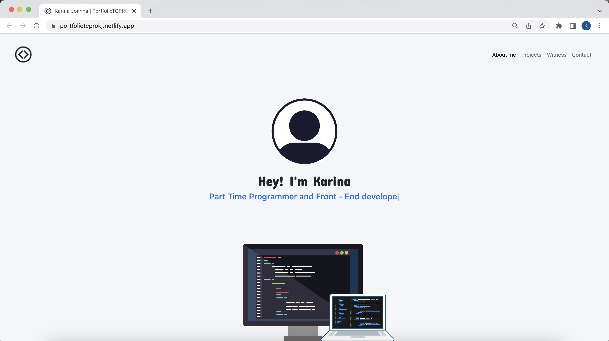
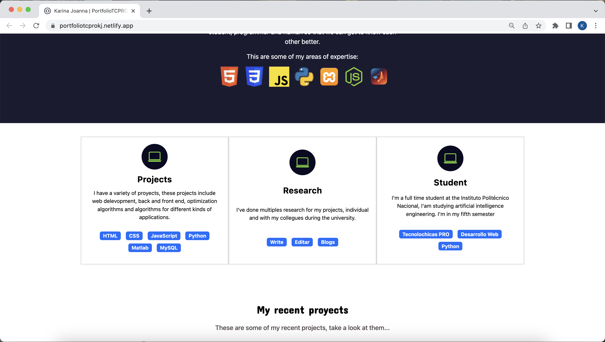
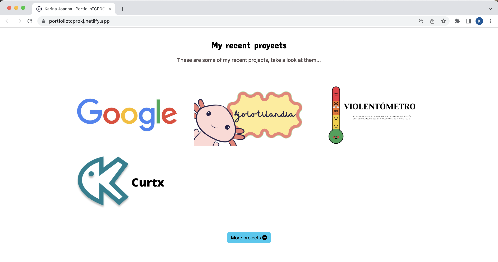

#  Portfolio 

This project, created for the Tecnolochicas PRO bootcamp, is a website that is responsive to devices of different sizes. 

Here you will find a showcase of my passion for web development and design. With a focus on creating visually stunning and functional websites, I strive to deliver memorable user experiences. From captivating animations to seamless navigation, I bring creativity and technical expertise to every project. Explore my work and discover how I can bring your digital presence to life."

El propósito de esta página web es mostrar el portafolio de proyectos de un(a) desarrollador(a) y su experiencia. Incluye una descripción breve de su motivación, experiencia, proyectos, artículos publicados y formas de contacto. 

También incluye imágenes alternativas en la carpeta `imagenes` en caso de que se desee personalizar la imagen principal del desarrollador, además de animación a la escritura de la página web con JavaScript.

### Screenshots

Primera parte de la página web:

Experiencia:

Proyectos:

Testimonios:

Contacto:

## Tecnologías

This page was created using:

* HTML
* CSS
* JavaScript 
* Bootstrap 5

Additionally, **Google Fonts**  were included to customize the font, and **Bootstrap icons**  were incorporated to add icons such as arrows and logos of popular social media platforms.

## English

The text on the webpage is written in English, including custom classes and attributes. Bootstrap-related classes are included in English.

